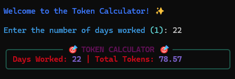

# Python Rich Terminal Tools

Practical terminal tools with personality. Built with Python's Rich library for beautiful, functional CLI experiences.

## Projects

### 🔧 Git Repository Manager
**Multi-repo git operations made simple**

Batch git operations across multiple repositories with live progress tracking and SSH validation. Built to eliminate the tedium of running `git -C repo pull` manually across multiple projects.

**Key Features:**
- **Batch operations**: Pull, push, commit, status across all repos simultaneously
- **Live progress display**: Real-time feedback with Rich progress bars
- **SSH connectivity checks**: Validates server access before operations
- **Automatic discovery**: Finds all git repositories in specified directory
- **Dual modes**: Interactive TUI or direct CLI commands
- **Timestamped logging**: Track all operations with detailed logs

**Use Cases:**
- Managing multiple project repositories
- Syncing dotfiles and configuration repos
- Batch backup operations
- Quick status checks across projects

**Screenshots:**

*Batch pull with live progress tracking*

*Push operations with SSH validation*

*Works on Android via Termux*

📖 [View Git Manager Documentation](./gitManager/)

---

### ⏰ TimeExisting: The Existential Progress Tracker
**Time tracking with philosophical commentary**

A darkly humorous CLI tool that transforms mundane time tracking into an existential experience. Because if you're going to stare at a progress bar all day, it might as well acknowledge the absurdity of it all.

**Key Features:**
- **Real-time progress tracking**: Work sessions, breaks, and seasonal changes
- **Break notifications**: Reminds you that even wage slaves need rest
- **Seasonal themes**: Because corporate monotony changes with the weather
- **Weekend vibes**: Different energy for different days
- **Rich terminal UI**: Beautiful ASCII art and smooth animations
- **Showcase mode**: Demo all states and transitions
- **Philosophical commentary**: Existential observations on the daily grind

**Evolution:**

*Current state: Fully featured existential companion*

*How it started: Simple progress tracking*

*Work status with seasonal awareness*

📖 [View TimeExisting Documentation](./progress/)

---

## Quick Start

## Requirements

- Python 3.7+
- Rich library for terminal UI
- Git (for repository manager)
- See individual `requirements.txt` files for specific dependencies

## Philosophy

Good tools should solve real problems *and* be enjoyable to use.

- **Git Manager**: Built because running `git -C repo pull` across multiple repositories gets old fast. SSH validation came from actual pain points with broken connectivity.
- **TimeExisting**: Work tracking doesn't have to be soul-crushing. If I'm going to monitor time all day, it might as well acknowledge the absurdity.

The best way to learn a library is to build something you'll actually use. These aren't portfolio pieces created for résumés—they're tools I use daily that happen to demonstrate technical skills.

**Core principles:**
- Solve your own problems first
- Add personality where it doesn't compromise function
- Learn by building things you'll maintain
- Terminal UIs can be beautiful *and* useful

## Technical Highlights

- **Rich library mastery**: Progress bars, live displays, panels, tables, ASCII art
- **Async operations**: Efficient batch processing for git operations
- **Error handling**: Graceful degradation and informative error messages
- **Cross-platform**: Works on Linux, macOS, Windows, and Android (Termux)
- **Logging**: Comprehensive operation tracking for debugging

## Author

**Gabriele Saronni**  
Network Engineer & Python Developer

[LinkedIn](https://linkedin.com/in/gabriele-s-54514173) | [GitHub](https://github.com/gsaronni)

---

*Tools built from real operational needs and a healthy appreciation for the absurd.*