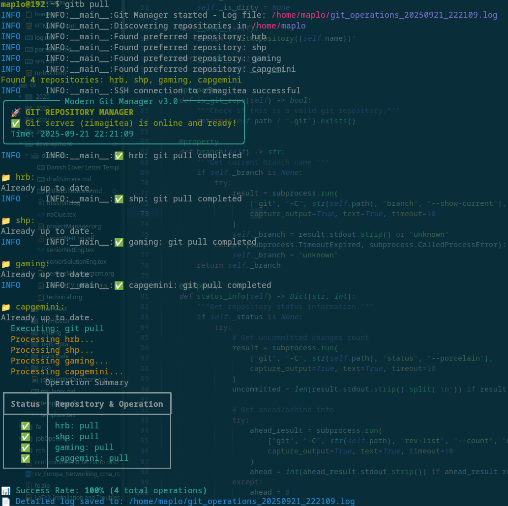
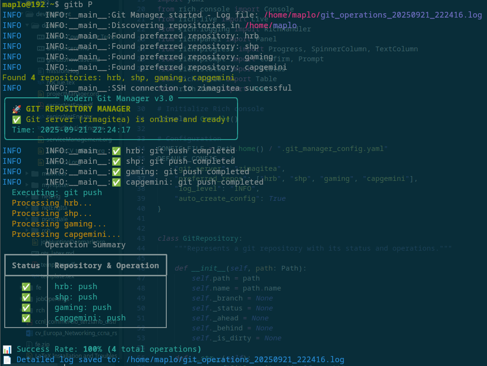
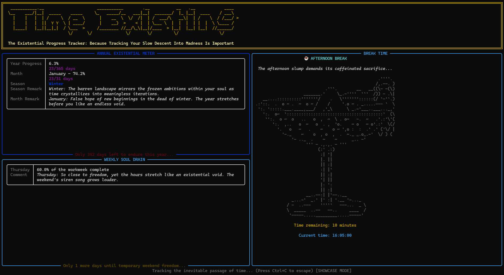
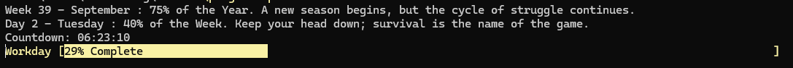

# Python RichLibrary
Some scripts that got en'Rich'ified

## Git Repostiory Manager
Multi-repo git operations made simple. 
Python tool with Rich UI that manages multiple git repositories simultaneously. 
Supports batch operations (pull, push, commit, status) across all repos with live progress tracking, SSH connectivity checks, and interactive/CLI modes.

Key features: Batch git operations
• Live progress display
• Repository discovery
• SSH server validation
• Timestamped logging

- 
- 
- 

## TimeExisting: The Existential Progress Tracker
A darkly humorous Python CLI tool that transforms mundane time tracking into an existential experience. Built with Rich for beautiful terminal UI, it monitors work progress, break times, and seasonal changes while delivering philosophical commentary on the futility of corporate existence. Features ASCII art, smooth animations, weekend activity tracking, and a showcase mode to demo all states. Perfect for developers who appreciate dark humor and want to make their daily grind slightly more entertaining.  

Key Features: Real-time progress tracking, break notifications, seasonal themes, weekend vibes, rich terminal UI with ASCII art, and existentially dreadful commentary.

Current situation
- 

How it started
- 

