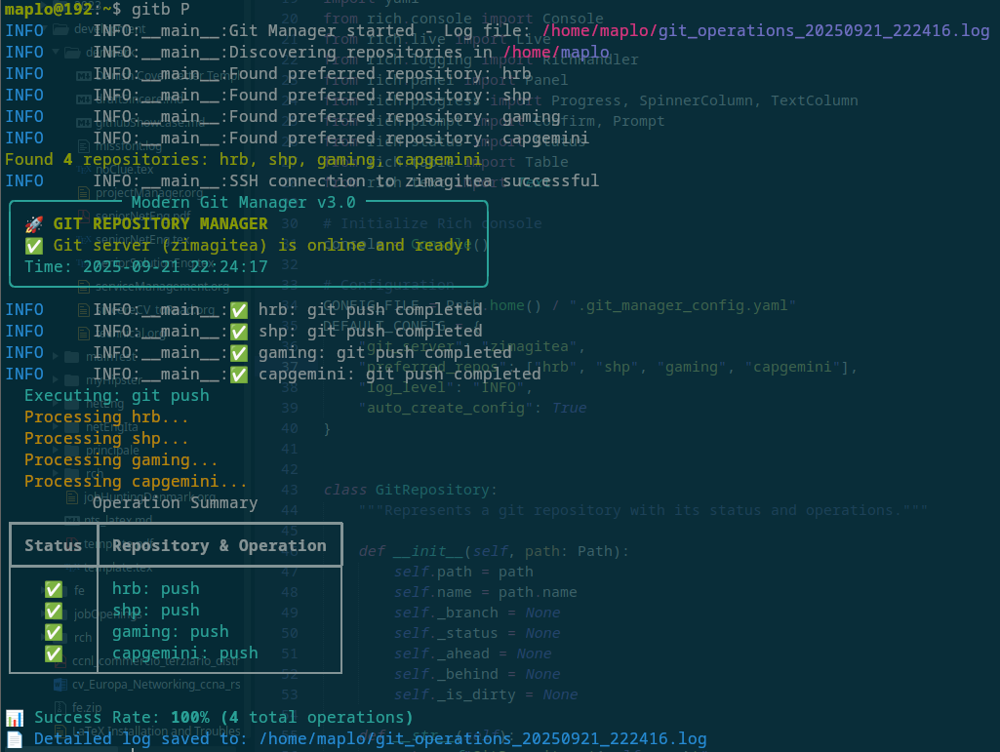
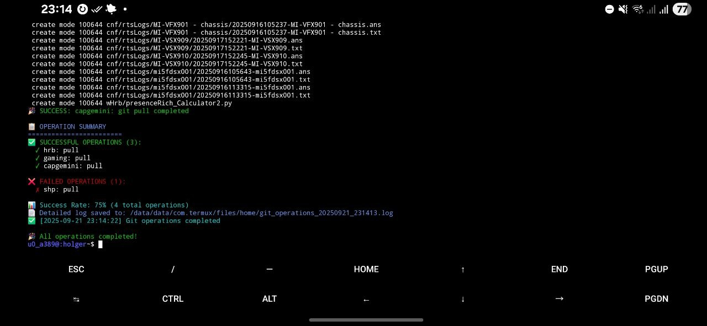

# pythonRichLibrary
Some scripts that got en'Rich'ified

## Git Repostiory Manager
Multi-repo git operations made simple. 
Python tool with Rich UI that manages multiple git repositories simultaneously. 
Supports batch operations (pull, push, commit, status) across all repos with live progress tracking, SSH connectivity checks, and interactive/CLI modes.

Key features: Batch git operations
• Live progress display
• Repository discovery
• SSH server validation
• Timestamped logging

- 
- 
- 

